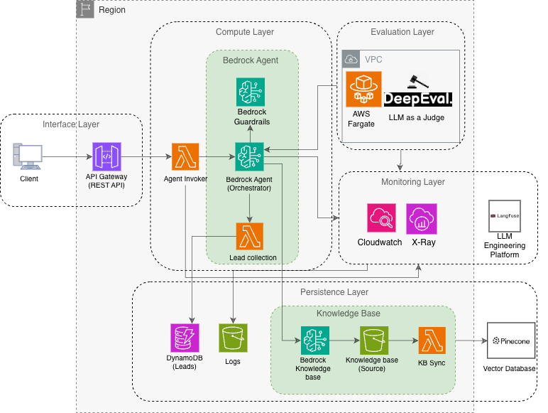

# Serverless Bedrock Agent

A conversational AI agent built on Amazon Bedrock, deployed to AWS via CDK. It handles lead collection, retrieves information from a knowledge base, and exposes a REST API secured with an API key and IP-based resource policy. A DeepEval-powered evaluation pipeline runs on every staging deployment to gate production releases.

> **Note:** This is a replica of the original private repository, shared for reference purposes. While active development continues in the private version, this repository is intended to showcase the project structure. Please note that the assets included here are samples of the original files as the project has evolved over time. This specific repository will not be further maintained. Further information about usage and deployment can be found at [Medium](https://medium.com/@alvarog2491/scalable-serverless-bedrock-agent-e4e2dc30fe6b).

## Tech Stack

- **Infrastructure**: AWS CDK (TypeScript), AWS Bedrock, API Gateway, Lambda (Python), DynamoDB, S3, ECS Fargate, X-Ray and CloudWatch
- **Agent**: Amazon Bedrock
- **Evaluation**: DeepEval running on ECS Fargate (LLM as a Judge)
- **CI/CD**: GitHub Actions
- **Runtime**: Node.js >= 20, Python 3.12

## Architecture Overview

The project is split into 5 CDK stacks:
| Stack | Responsibility |
|---|---|
| `PersistenceStack` | S3 buckets (knowledge base docs, eval results), DynamoDB lead table, Bedrock Knowledge Base |
| `ComputeStack` | Amazon Bedrock agent with action groups wired to the knowledge base and lead table |
| `InterfaceStack` | API Gateway, API key, IP-based resource policy |
| `MonitoringStack` | CloudWatch dashboard with token usage and cost widgets, X-Ray, LangFuse|
| `EvaluationStack` | ECS Fargate cluster running DeepEval against the staged agent (staging only) |

## License

This project is licensed under the MIT License - see the [LICENSE](LICENSE) file for details.
