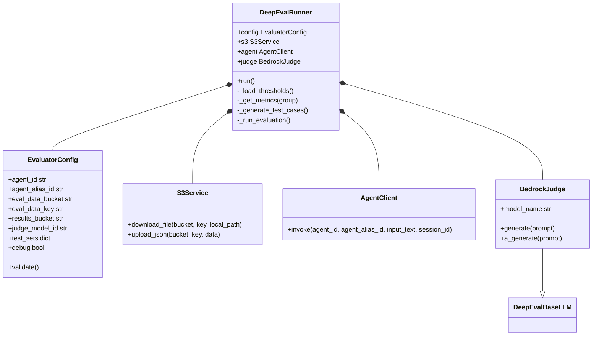

# DeepEval Evaluator

This directory contains the logic for evaluating the Bedrock Agent using DeepEval metrics. It is designed to run as an ECS Fargate task but can also be executed locally for testing.

## Prerequisites

- Python 3.12+
- AWS Credentials configured with permissions to:
    - Invoke the Bedrock Agent
    - Read/Write to the S3 Results Bucket
    - Invoke Bedrock Foundation Models (Judge LLM)

## Local Execution

### 1. Install Dependencies

```bash
pip install -r requirements.txt
```

### 2. Configure Environment Variables

Create a `.env` file in this directory based on `.env.example`:

```bash
cp .env.example .env
# Edit .env with your actual values
```

Alternatively, you can export them in your terminal.

### 3. Run the Evaluator

To run all test sets:
```bash
python evaluator.py
```

To run a specific test set (for faster experimentation):
```bash
python evaluator.py --test-set golden_set_happy_path.jsonl
```

Available datasets:
- `golden_set_happy_path.jsonl`
- `golden_set_edge_case.jsonl`
- `golden_set_adversarial.jsonl`

## Docker Execution

### 1. Build the Image

```bash
docker build -t deepeval-evaluator .
```

### 2. Run the Container using the .env file

```bash
docker run --rm \
  --env-file .env \
  -v ~/.aws:/root/.aws \
  deepeval-evaluator
```

> [!NOTE]  
> The `-v ~/.aws:/root/.aws` flag is used to mount your local AWS credentials into the container for local testing. In Fargate, the task role will handle authentication.

## Architecture

The following class diagram illustrates the relationships between the main components of the evaluation job:



## How it Works

1.  **Downloads Test Sets**: Fetches `.jsonl` files from S3 defined in the `EVAL_DATA_KEY` prefix.
2.  **Invokes Agent**: For each test case, it calls the Bedrock Agent and captures the response and retrieval context.
3.  **Calculates Metrics**: Uses DeepEval to run specific metrics based on the test set group:
    -   **Happy Path (`rag`)**: Faithfulness, Contextual Recall.
    -   **Edge Cases (`rag_edge`)**: Faithfulness, Answer Relevancy.
    -   **Adversarial (`adversarial`)**: Safety Refusal (Custom GEval).
4.  **Threshold Enforcement**: All metrics are validated against thresholds defined in `metrics_thresholds.json`. This file is the single source of truth for both the evaluator and the CI/CD verification script.
5.  **Signals Completion**: Uploads a detailed JSON report to the `RESULTS_BUCKET` using the ECS Task ID in the filename: `reports/eval-report-{task_id}.json`.
